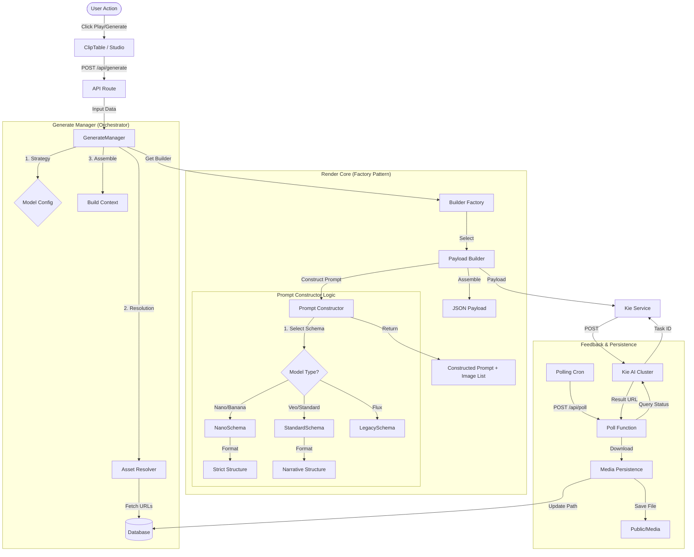

# Render Engine Architecture

## Overview
This document details the architectural flow of the ArcRunner Render Engine, tracing the lifecycle of a generation request from user interaction to file persistence. It is intended for architects and developers requiring a deep understanding of component logic, state management, and data transformation.

## Component Flow Diagram

## 1. Touchpoints
### Overview
The entry point for all generation.
*   **Clip Table**: Invoked via Play icon (Single) or Toolbar (Batch). Compiles the current UI state (Edit Mode values override saved DB values).
*   **Studio**: Generates Reference Images for Characters/Locations.

### Internal Logic
The frontend performs minimal validation. It packages the raw `Clip` object (including unsaved edits) and sends it to `/api/generate`. This ensures "What you see is what you get," even if changes aren't committed to the database yet.

---

## 2. Generate Manager
**Location**: `src/lib/generate-manager.ts`

### Internal Logic & Flow
The `GenerateManager` acts as the **Orchestrator**. It creates the deterministic environment for generation.

1.  **Strategy Selection**:
    *   Determines the `effectiveModelId`. It checks the `Input Override` first, then falls back to the `Episode` model.
    *   Retrieves `ModelConfig` to determine the `apiStrategy` (e.g., 'veo', 'nano') and `builderId`.

2.  **Asset Resolution (The Data Layer)**:
    *   Parses the prompt text for entity names (e.g., "Location: Bar").
    *   Queries `db.studioItem` for matching assets.
    *   **Crucial Step**: It resolves the *Image Mode*.
        *   **Nano/Veo**: Resolves *all* asset images (Location Image + Character Images) for composite prompting.
        *   **Flux (Legacy)**: May resolve only a single reference image depending on the mode.

3.  **Context Assembly**:
    *   Constructs a `GenerationContext` object. This is a rich standardized object containing:
        *   `input`: Raw user options.
        *   `locationAsset`, `characterAssets`: Full rich objects (Names, Descriptions, Negatives).
        *   `publicImageUrls`: The resolved, accessible URLs for the AI.

---

## 3. Prompt Constructor
**Location**: `src/lib/builders/PromptConstructor.ts`

### Architectural Role
This component creates the **Semantic Interface** between our structured data and the AI's natural language understanding. It uses the **Factory Pattern** combined with the **Strategy Pattern**.

### Internal Logic & Flow
The `construct(context)` method executes in three distinct phases:

#### Phase 1: Logic (Image Manifest)
*   **Component**: `PromptSelector.select(context)`
*   **Purpose**: Determines *which* images are chemically active for the generation.
*   **Logic**:
    *   Slot 0: Location Image (Always, if present).
    *   Slot 1..N: Character Images.
    *   Slot N+1: Style Reference Image (if `Style` asset has an image).
*   **Output**: An `ImageManifest` mapping slots to URLs.

#### Phase 2: Factory (Schema Selection)
*   **Purpose**: Selects the linguistic structure based on the Model ID.
*   **Logic**:
    *   **If** `model.includes('nano')` OR `model.includes('banana')` -> **Select `NanoSchema`**.
    *   **If** `model.includes('flux')` -> **Select `LegacySchema`**.
    *   **Else** (Veo, Kling) -> **Select `StandardSchema`**.

#### Phase 3: Presentation (Formatting)
The selected Schema's `format()` method is called.

*   **`NanoSchema` Logic (`src/lib/builders/prompt/schemas/NanoSchema.ts`)**:
    *   **Priority Rule**: Enforces checking if a **Style Image** exists. If so, it injects a generic "System Priority Rule" to `IGNORE` the subject of the Style Image.
    *   **Structure**:
        1.  **Header**: Style definition.
        2.  **SETUP / REFERENCE**: Iterates through Location and Characters, appending their specific `descriptions` and `negatives`.
        3.  **ACTION**: Combines the `Action` text with the `Dialog` (formatted as `\n\nDialog`).
        4.  **Footer**: Appends the explicit `Clip Negative Prompt` (`NO: [...]`).
    *   **Optimization**: Removes redundant global summaries ("OUTPUT SUBJECT") to reduce token usage and confusion.

*   **`StandardSchema` Logic**:
    *   Uses a "Narrative" approach suitable for Veo/Sora class models.
    *   Weaves metadata into a flowing paragraph structure rather than strict JSON-like blocks.

---

## 4. Payload Builders
**Location**: `src/lib/builders/`

### Internal Logic & Flow
Each model application (Veo, Nano) has a specific `PayloadBuilder` implementation (e.g., `PayloadBuilderVeo`).

1.  **Validation**: `validate(context)` enforces hard constraints.
    *   *Example*: `PayloadBuilderVeo` checks if S2E (Start-to-End) is requested. If fewer than 2 images exist, it *downgrades* the request to `Reference-to-Video` and logs a warning.

2.  **Build**: `build(context)`
    *   Calls `PromptConstructor` to get the final text.
    *   Maps internal types to external API fields.
    *   **Aspect Ratio Handling**:
        *   Nano: Enforces strict aspect ratios.
        *   Flux: May inject dummy placeholder images (`empty.png`) if the API requires an image input but none provided (Text-to-Image patch).

---

## 5. Service Layer (Kie API)
**Location**: `src/lib/kie.ts`

### Internal Logic
*   **Abstraction**: Wraps the raw Axios/Fetch calls.
*   **Error Handling**: Standardizes HTTP errors (401, 500) into application-level exceptions.
*   **Return Type**: Returns a `KieTask` object containing `{ taskId, status }`.

---

## 6. Feedback Loop (Polling & Persistence)
**Location**: `src/app/api/poll/route.ts`

### Architectural Role
Decouples the long-running generation process from the user interface.

### Internal Logic
1.  **Cron / Hook**: The frontend hook `usePolling` triggers the `/api/poll` route.
2.  **Status Check**: Iterates through active Task IDs.
3.  **Completion Handling (The "Done" State)**:
    *   **Detection**: If Kie API returns `status: 'Done'` with a `resultUrl`.
    *   **Persistence Action**: Invokes `persistClipMedia(remoteUrl)`.
        *   Downloads the file stream.
        *   Saves to `public/media/generations/clip_{id}_{timestamp}.mp4`.
        *   Generates a Thumbnail.
    *   **Atomic Data Update**: performing a DB Update only *after* successful persistence. 
        *   **History Preservation**: The new local path is *prepended* to the existing `resultUrl` CSV list (handled robustly as an array). This ensures the user always sees the latest generation first, while maintaining a history of previous attempts.
    *   *Why?*: This ensures we never depend on the ephemeral remote URL provided by the AI vendor. The asset is now owned by the system.
