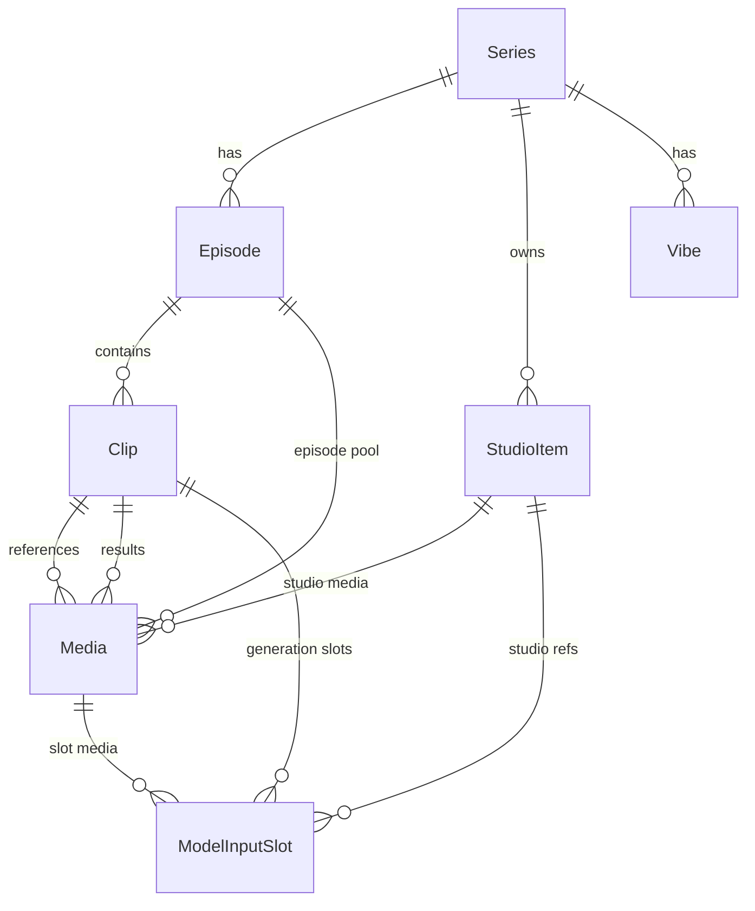
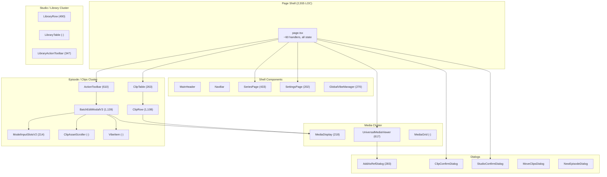
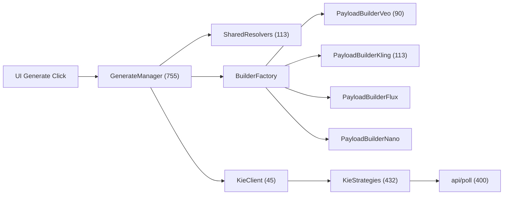

# ArcRunner v0.33.2 — Architectural Review

## Codebase At a Glance

| Layer | Files | LOC | Notes |
|---|---|---|---|
| **Frontend** (`page.tsx`) | 1 | **2,555** | Monolith orchestrator |
| **Components** | ~55 | ~8,000 | 10 subdirectories |
| **API Routes** | 33 | **4,091** | Next.js route handlers |
| **Core Logic** (`lib/`) | 22 + 3 dirs | **4,489** | Engine, builders, strategies |
| **Hooks** | 7 | ~650 | State, polling, persistence |
| **Types** | 1 | 70 | Shared interfaces |
| **Schema** | 7 models | 188 | SQLite via Prisma |
| **Total** | **~120** | **~23,500** | |

---

## Data Model

### Key Entities (7 Models)

| Model | PK Type | Role |
|---|---|---|
| **Series** | UUID | Top-level container (e.g. "Roswell") |
| **Episode** | UUID | Production unit with generation settings |
| **Clip** | autoincrement int | Individual scene — the core work unit |
| **Media** | UUID | Normalized media record (image/video) |
| **StudioItem** | autoincrement int | Reusable asset (Character, Location, Style, Camera) |
| **Vibe** | UUID | Reusable prompt snippet (Action, Camera, Movement) |
| **ModelInputSlot** | UUID | **Bridging join table** — connects Clip ↔ Media/StudioItem for generation payload |

### Relationship Highlights

- **Media** is the SSoT hub — linked to Clips (as reference or result), StudioItems, Episodes, and ModelInputSlots
- **ModelInputSlot** is the newest architectural addition: a polymorphic join table where each slot can point to either a `Media` record or a `StudioItem`, ordered by `sortOrder`
- **Clip** still carries legacy text fields (`character`, `location`, `style`, `camera`) alongside the relational architecture — dual-read pattern for backwards compatibility

---

## Component Architecture

### Cluster Breakdown

#### 1. Episode / Clips (6,600+ LOC across ~13 files)
The heaviest cluster. Responsible for the main working interface.

| Component | LOC | Role |
|---|---|---|
| `ActionToolbar` | 610 | Model selector, batch generate, batch download, style/audio/duration controls, hosts BEM |
| `ClipTable` | 263 | Table shell, column headers, traffic light filter, drag-and-drop sorting |
| `ClipRow` | 1,108 | Individual row: display/edit mode, thumbnails, inline editing, ref images, traffic light |
| `BatchEditModalV3` | 1,139 | Full-screen modal: Asset Pool, Model Input Slots, Latest Result, Vibes menu |
| `ModelInputSlotsV2` | 214 | Renders the active generation payload slots based on structural manifest |
| `ClipAssetScroller` | — | Horizontal scroller for clip generation history |

> **Note**: `BatchEditModalV2` (948 LOC) still exists as dead code

#### 2. Studio / Library (840+ LOC, 3 files)
Mirrors the Episode cluster for reusable assets.

| Component | LOC | Role |
|---|---|---|
| `LibraryRow` | 490 | Display/edit row for Studio characters, locations, styles, cameras |
| `LibraryActionToolbar` | 347 | Generation controls specific to Studio assets |
| `LibraryTable` | — | Table shell for Studio items |

#### 3. Media (835+ LOC, 4 files)
Cross-cutting media display and interaction layer.

| Component | LOC | Role |
|---|---|---|
| `UniversalMediaViewer` | 617 | Full-screen viewer: playlist navigation, persistence, add-as-ref, open folder |
| `MediaDisplay` | 218 | Reusable image/video display with persistence overlay |
| `MediaGrid` | — | Grid layout for Media Library page |

#### 4. UI Primitives (19 files)
Mostly `shadcn/ui` components (`button`, `dialog`, `tooltip`, `popover`, etc.) plus 3 custom components:
- `EditableCell` — inline text editing
- `ImageUploadCell` — drag-and-drop image upload
- `RowActions` — per-row action buttons (generate, download, duplicate, delete)

---

## API Surface (33 Routes, 4,091 LOC)

### Tier 1 — Heavy (200+ LOC)
| Route | LOC | Methods | Purpose |
|---|---|---|---|
| `/api/clips` | 544 | GET, POST, PUT, DELETE | CRUD for clips (the workhorse) |
| `/api/poll` | 400 | GET | Generation status polling with multi-strategy dispatch |
| `/api/generate-library` | 349 | POST | Studio asset generation |
| `/api/media/add-ref` | 226 | POST | Add media as reference to clip + MIS slot creation |
| `/api/media/persist` | 222 | POST | Download remote media → local cache + symlink |
| `/api/update_clip` | 194 | POST | Clip field updates with whitelist firewall |

### Tier 2 — Medium (50–200 LOC)
`/api/library`, `/api/proxy-download`, `/api/vibes`, `/api/ingest`, `/api/media/unlink`, `/api/studio`, `/api/migrate_status`, `/api/archive`, `/api/media/copy-ref`, `/api/backfill`, `/api/update_library`, `/api/lock`

### Tier 3 — Light (<50 LOC)
`/api/generate`, `/api/generate-image`, `/api/episodes`, `/api/series`, `/api/update_episode`, `/api/update_series`, `/api/sort`, `/api/move-clips`, `/api/renumber`, `/api/seed-repair`, `/api/media/delete-local`, `/api/media/open-folder`, `/api/settings`, `/api/system`, `/api/log`, `/api/log_beacon`, `/api/images`, `/api/debug-db`, `/api/proxy-image`

---

## Core Engine (`lib/`, 4,489 LOC)

### Generation Pipeline

| Module | LOC | Role |
|---|---|---|
| `generate-manager.ts` | 755 | Central orchestrator — resolves assets, selects builder, calls Kie, writes results |
| `kie-strategies.ts` | 432 | Polling strategies per model (Veo, Flux, Nano, Kling) |
| `structural-manifest.ts` | 148 | Defines MIS slot layout per model (slot count, labels, types) |
| `models.ts` | 106 | Model registry — config, validation rules, `isImage` flag |
| `builders/` | ~400 | 4 model-specific payload builders + prompt system |
| `shared-resolvers.ts` | 113 | Image resolution: Character/Location → URL lookup |

### Support Modules

| Module | LOC | Role |
|---|---|---|
| `media-service.ts` | 300 | Media CRUD, reference syncing, Studio syncing |
| `defaults.ts` | 236 | Default prompt templates, model defaults |
| `storage.ts` | 144 | File path resolution (public → storage fallback) |
| `download-utils.ts` | 132 | Filename generation, download helpers |
| `media-persistence.ts` | 96 | Persist media to local disk + symlink |
| `clip-status.ts` | 103 | Traffic light computation from clip state |
| `image-processing.ts` | 89 | Image resize/crop for API requirements |

---

## Hooks (7 files, ~650 LOC)

| Hook | LOC | Role |
|---|---|---|
| `useDataStore` | 211 | Zustand store — clips, library, series state |
| `useMediaArchiver` | 160 | Batch download/archive orchestration |
| `usePolling` | 125 | Generation status polling loop |
| `useMediaPersistence` | 80 | Single-clip persist to local disk |
| `useRowShortcuts` | 60 | Keyboard navigation for table rows |
| `useSharedSelection` | 45 | Multi-select state management |
| `useClickOutside` | 40 | DOM click-outside detection |

---

## The `page.tsx` Monolith (2,555 LOC)

This is the elephant in the room. `page.tsx` is both the application's central nervous system and its single biggest risk.

### What It Does
- **~60 handler functions** covering: CRUD, generation, persistence, navigation, editing, selection, downloads
- **All top-level state** — clips, library items, series, episodes, views, models, styles, seeds, audio, duration
- **All prop drilling** — every component receives its callbacks and state from here
- **Side effects** — localStorage reads/writes, URL param management, polling coordination

### Structural Zones (approximate)
| Lines | Zone |
|---|---|
| 1–200 | Initialization, data fetching, URL params |
| 200–600 | Episode/Series CRUD handlers |
| 600–900 | Generation flow (batch + single), confirmation dialogs |
| 900–1100 | State declarations, memoized computations |
| 1100–1700 | `handleGenerate`, `handleSave`, clip manipulation |
| 1700–2100 | UVM event handlers, media operations, downloads |
| 2100–2555 | JSX render — toolbar, table, modals, dialogs |

### Risk Assessment
- **Coupling**: Every feature change touches this file
- **Testing**: Untestable in isolation — no unit boundary
- **Merge conflicts**: High probability with parallel work
- **Cognitive load**: 60+ handlers is beyond comfortable working memory

---

## Observations & Takeaways

### Architecture Wins Since v0.28
1. **Media normalization** — `Media` table as SSoT eliminated CSV ghost data
2. **ModelInputSlot bridging table** — clean separation of "what the model sees" from "what the clip owns"
3. **Structural manifest** — declarative slot definitions per model
4. **Strategy pattern** — `BuilderFactory` + per-model builders + `KieStrategies` 
5. **Traffic light system** — computed status from clip state, not stored

### Growth Pressure Points
1. **`page.tsx` (2,555 LOC)** — the single biggest scaling bottleneck
2. **`BatchEditModalV3` (1,139 LOC)** — becoming its own monolith with asset pool, MIS, vibes, latest result, persistence
3. **`ClipRow` (1,108 LOC)** — display/edit mode logic, thumbnail rendering, inline editing all in one component
4. **`generate-manager.ts` (755 LOC)** — asset resolution + payload building + API call + result writing all interleaved
5. **33 API routes** — some are operational/debug leftovers that could be pruned
6. **Dead code** — `BatchEditModalV2.tsx` (948 LOC), `MediaPreviewModal.deprecated.tsx`, `PromptConstructor_DRAFT.ts`
